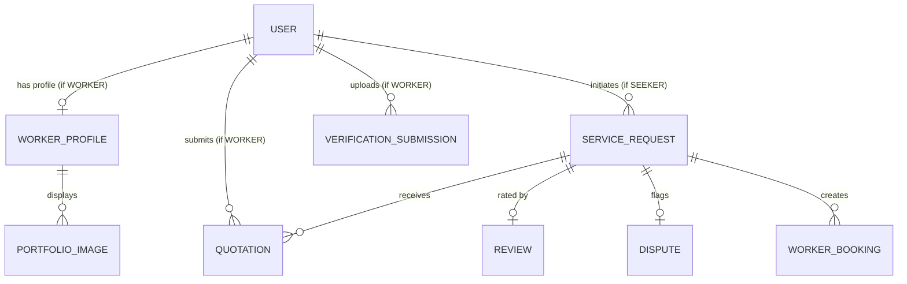

# Skill-Exchange (LankaFIX / WedaLK) - Project Technical Documentation

This document provides a comprehensive technical overview of the **Skill-Exchange** repository (also known as LankaFIX / WedaLK). It details the architecture, design choices, data flow, API contracts, security mechanisms, and routing guards to give LLMs/developers an instant, high-fidelity understanding of the codebase.

---

## 1. Project Overview & Architecture
Skill-Exchange is a full-stack local services marketplace tailored for Sri Lanka. It connects service seekers (clients) with local workers (electricians, plumbers, carpenters, etc.) and provides administrators with oversight over registration, verification, and disputes.

### Core Roles (RBAC)
- **`SEEKER`**: Post service requests, browse verified workers, accept quotations, make bookings, leave reviews, and initiate disputes.
- **`WORKER`**: Create and edit profiles (skills, rates, location, availability), submit documents for admin verification, view open requests, and submit quotations.
- **`ADMIN`**: Manage users, review and approve/reject worker verification submissions, view all service request details, and resolve seeker disputes.

---

## 2. Tech Stack & Environment

### Backend
- **Framework**: Spring Boot 3.2.2 (Java 17)
- **Database**: PostgreSQL (Hibernate/JPA for ORM)
- **Security**: Spring Security & JWT (`jjwt` v0.12.3)
- **Build Tool**: Maven

### Frontend
- **Framework**: React 19 (Created via Create React App)
- **Routing**: React Router DOM v7
- **Styling**: Tailwind CSS v3.4 + PostCSS
- **API Client**: Axios

### Key Third-Party Integrations
- **Google Gemini API**: Used for AI-powered description drafting of service requests.

---

## 3. Directory Structure

```
Skill-Exchange/
├── backend/WedaLK/demo/          # Spring Boot Application Root
│   ├── src/main/java/lk/wedalk/
│   │   ├── admin/                # Admin endpoints & workflows (disputes, verification status)
│   │   ├── auth/                 # Registration, login, password encoding
│   │   ├── bookings/             # Booking schedules & status controls
│   │   ├── common/               # Shared API responses, error handling, enums, exceptions
│   │   ├── config/               # Security, CORS, DB seeders, schema migrations
│   │   ├── disputes/             # Dispute resolution logic
│   │   ├── health/               # Simple public endpoint to verify backend status
│   │   ├── payment/              # Payment submission (e.g. slips, worker registration fees)
│   │   ├── profiles/             # Worker bio, skills, service areas, hourly rates
│   │   ├── requests/             # Service request posting & AI description generation
│   │   ├── reviews/              # Seeker reviews & worker rating metrics
│   │   ├── security/             # JWT filters, Token services, UserDetails implementation
│   │   ├── users/                # Core user account operations & CRUD
│   │   └── verification/         # Multi-part document upload & worker verification state
│   └── src/main/resources/
│       └── application.properties # Server port, JDBC URL, JWT secret, AI configs
├── frontend/                     # React Application Root
│   ├── public/                   # Static page templates
│   └── src/
│       ├── components/           # Reusable components (UI, Toast, guards)
│       ├── context/              # Global application contexts
│       ├── hooks/                # Custom React hooks
│       ├── layouts/              # Main layout wraps (Navbars, footers)
│       ├── pages/                # Pages separated by roles (public, auth, seeker, worker, admin)
│       ├── services/             # Centralized API service classes (built on top of apiClient)
│       └── utils/                # Token/local storage management utilities
├── docs/                         # Sprint feature descriptions & API specs
└── uploads/                      # Local runtime file uploads (e.g., verification PDFs)
```

---

## 4. Backend Architecture & Infrastructure

### 4.1. Security & Authentication Model
- **Stateless Session**: Authentication is handled purely using JWT tokens. Sessions are disabled on the server side (`SessionCreationPolicy.STATELESS`).
- **`SecurityConfig`**: Maps endpoint prefixes to specific roles:
  - `/api/auth/**`, `/api/health` are publicly accessible.
  - Role check matches `Role` enums: `ROLE_SEEKER`, `ROLE_WORKER`, `ROLE_ADMIN`.
- **`JwtAuthenticationFilter`**: Reads `Authorization: Bearer <token>` from incoming requests, parses the subject (user email), verifies expiry, and loads security context into `SecurityContextHolder`.

### 4.2. Global Exception & Response Envelope
- **`ApiResponse<T>`**: Standard response wrapper for all controllers. It ensures that every response matches this structure:
  ```json
  {
    "success": true,
    "message": "Action completed successfully",
    "data": { ... }
  }
  ```
- **`GlobalExceptionHandler`**: Catch-all handler (`@RestControllerAdvice`) mapping standard exceptions (e.g. `BadCredentialsException`, `AccessDeniedException`, validation errors) into uniform `ApiResponse` models with consistent HTTP status codes.

### 4.3. Schema Migration & Data Seeding
- **`SchemaMigrationRunner`**: An idempotent command-line runner that drops PostgreSQL table constraints (like enum check constraints) before the data seeder runs. When running `ddl-auto=update`, Hibernate fails to update constraints if new values are added to Java enums. The runner drops these constraints to allow DB inserts.
- **`DataSeeder`**: Inserts default system accounts on first startup:
  - Admin Account: `admin@wedalk.lk` (password: `admin123` or loaded from env).
  - Worker Test Accounts: `worker1@test.com`, `worker2@test.com`, `worker3@test.com`.

---

## 5. Frontend Architecture & Contracts

### 5.1. Authentication Storage
Tokens are stored inside local storage using `frontend/src/utils/storage.js`. When a session expires or returns `401 Unauthorized`, `clearAuth()` is triggered, redirecting the user to the log-in page.

### 5.2. `apiClient.js` (Axios Interceptor)
All requests to the backend pass through `apiClient.js`:
- **Auth Headers**: Interceptor automatically injects `Authorization: Bearer <token>` if present.
- **Retry Logic**: Automatically retries GET requests failing with network errors or status codes `502`, `503`, or `504` up to 1 retry after `300ms`.
- **Error Normalization**: Maps error messages directly into a unified `error.userMessage` and `error.normalized` object, facilitating easy UI display using banners or toasts.

### 5.3. Frontend Routing & Guards (`src/App.js`)
Role-based routes are wrapped using two custom guards:
1. **`ProtectedRoute`**: Restricts access based on user role (`allowedRoles={['SEEKER']}`, etc.).
2. **`RequireWorkerProfile`**: Blocks verified workers from performing workspace actions (such as sending quotations or viewing assigned jobs) until they have completed their public worker profile.

---

## 6. Database Entities & Relationships



### Key Models
- **`User`**: Account fields (`fullName`, `email`, `password`, `phone`, `district`, `role`, `isSuspended`).
- **`WorkerProfile`**: Custom portfolio (`bio`, `skills`, `serviceAreas`, `hourlyRate`, `availability`, `registrationPaymentStatus`, `paymentRejectionNote`).
- **`ServiceRequest`**: Task information (`title`, `description`, `category`, `locationArea`, `budget`, `urgency`, `status`, `seeker`, `assignedWorker`).
- **`Quotation`**: Offers (`price`, `estimatedDays`, `message`, `status`, `request`, `worker`).
- **`Review`**: Completion feedback (`rating`, `comment`, `seeker`, `worker`, `serviceRequest`).
- **`Dispute`**: Issue flagging (`reason`, `resolution`, `status`, `outcome`, `seeker`, `worker`, `serviceRequest`).
- **`VerificationSubmission`**: PDF identity/license checks (`verificationStatus`, `adminNotes`, `documentPath`).

---

## 7. Key Feature Workflows & Domain Logic

### 7.1. Service Request Creation & AI Assist
- **Flow**: Seeker fills in title, category, location, and urgency. They can click "AI Assist" to generate a rich description.
- **Backend Constraints**: Generates a professional description draft using Gemini API, truncated to `2000` characters to fit within request limit.
- **Frontend Guard**: The UI blocks AI Assist if title or category are empty. The description input is disabled during generation, and an error banner is displayed if the backend returns `503 Service Unavailable`.

### 7.2. Worker Profile & Verification
- **Flow**: Workers register, complete their profile, and submit a PDF verification document.
- **Admin Verification Panel**: Admins view all pending submissions and download the PDF. They can change the verification status to `APPROVED` or `REJECTED`, optionally adding notes.
- **Workspace Access**: Workers are blocked from bidding on jobs until they have completed their profile.

### 7.3. Disputes Workflow
- **Rules**: If a job isn't completed or has severe issues, the Seeker changes the job status to `NOT_COMPLETED` and initiates a dispute.
- **Constraints**: 
  - Only the request owner (Seeker) can initiate a dispute.
  - Active only when request status is `ASSIGNED` or `NOT_COMPLETED`.
  - Duplicate disputes on the same request are blocked.
  - Admin resolves disputes via the Admin Dashboard.

---

## 8. API Endpoint Catalog

| Method | Endpoint | Allowed Roles | Description |
| :--- | :--- | :--- | :--- |
| **POST** | `/api/auth/register` | Public | Create new Seeker/Worker user |
| **POST** | `/api/auth/login` | Public | Login & retrieve JWT token |
| **GET** | `/api/users/me` | Authenticated | Retrieve current user profile |
| **POST** | `/api/requests` | `SEEKER` | Create service request |
| **POST** | `/api/requests/ai-description` | `SEEKER` | Run Gemini assistant request draft |
| **GET** | `/api/requests/browse` | Authenticated | Query and search open requests |
| **POST** | `/api/quotes` | `WORKER` | Submit quotation for a request |
| **POST** | `/api/quotes/{id}/accept` | `SEEKER` | Accept quotation (assigns worker) |
| **POST** | `/api/reviews` | `SEEKER` | Submit request review |
| **POST** | `/api/disputes` | `SEEKER` | Initiate dispute (sets request to `NOT_COMPLETED`) |
| **GET** | `/api/verification/pending` | `ADMIN` | Retrieve all pending worker docs |
| **PUT** | `/api/verification/{id}/status` | `ADMIN` | Approve or reject verification |

---

## 9. Run, Build & Verification Commands

### Environment variables (Optional / Contextual)
- **Backend properties** (`backend/WedaLK/demo/src/main/resources/application.properties`):
  - DB setup needs a PostgreSQL server running at `localhost:5432` with a database named `lankafix`.
  - To enable AI assistance, set `GEMINI_API_KEY` in your local environment.

### Development Bootup

#### Backend
```bash
# Navigate to backend directory
cd backend/WedaLK/demo

# Build package
./mvnw.cmd clean package

# Run development server (runs on port 8081)
./mvnw.cmd spring-boot:run

# Run Unit/Integration tests (H2 database used)
./mvnw.cmd test
```

#### Frontend
```bash
# Navigate to frontend directory
cd frontend

# Install package dependencies
npm install

# Run React dev server (runs on port 3000)
npm start

# Run frontend lint check
npm run lint

# Run frontend tests
npm test -- --watchAll=false
```
